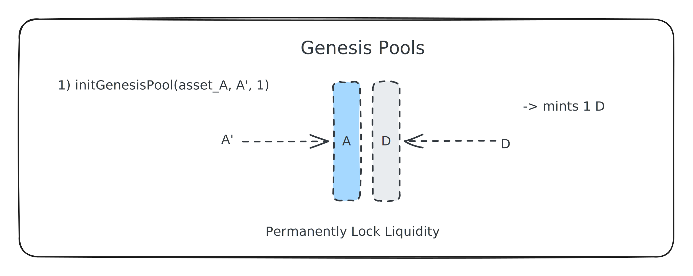

# Liquidity

### Genesis Pools

Genesis Pools are created by the owner, which mints the initial supply of `D` and allocates it to a set of pools eg WBTC, WETH, USDT and USDC and DECA. The genesis pool liquidity is permanently locked and can never be withdrawn. After minting and allocating the initial supply of `D` the D supply is there-after programmatically controlled.&#x20;



### Pool Creation

Anyone can add a new pool by providing the starting liquidity:

1. Another existing asset `A` which will stream to `D`&#x20;
2. The asset to match `B`


### Adding Liquidity

Users stream-add liquidity into the pool. The market should provide D if the asset being added is liquid. If it is not, then nobody will arbitrage, signalling the token is worthless. This will prevent the system being attacked by zombie coins, especially when it comes to allowing lending on all pools. There will be a small slippage as price to pay to add liquidity.&#x20;

LP Ownership units (internal mappings) are based on deposited assets compared with existing units. Users never have a claim on the D Units, they can only claim the assets paired to it.&#x20;


$$
p' = P * \frac{d'A+Dd'+2DA}{d'A+Da'+2d'a'}
$$

### Removing Liquidity

Users remove liquidity by redeeming their liquidity shares `P'` which stream removes their claim on the liquidity. Arbitrage should re-balance the pools throughout. The share of the Asset side is \*twice\* the depth, since the pool is dual-sided.&#x20;



Liquidity is always streamed in and streamed out. This will allow arbitrage to occur to correct price imbalances.&#x20;


```
A' = 2 * (A * P' / P)
```


