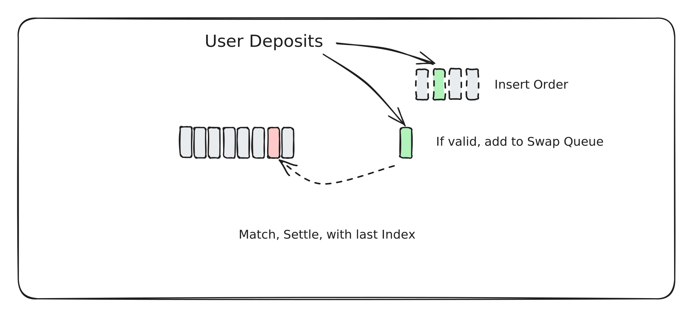

# Overview

### System Overview

All pools are single-sided on the protocol, but&#x20;

1. Asset Pools (WBTC, WETH) etc
2. Global Pool (D)
3. DECA Pool (DECA)

### All Pools

All pools are single-sided, with only external assets deposited. They are matched to an internal, arbitrary, unit of account referred to as “D”. Deposited liquidity is streamed in, which acquires the `D` asset thorugh arbitrage against all other pools. The reverse happens when liquidity is removed. Since D is matched to all pools, flows across pools simply move the D between, but D never leaves the contract.


If a zombie asset is added, no arbitrage will occur and the LP will experience negative slip on their own assets.&#x20;



&#x20;LPs cannot hold D, so when they deposit, they are taking up a short position of their asset versus {everything else} and are notionally long the volatility of that pool. Because of this, it makes sense to only pay the LP in USDC, and separate the principle from the yield.&#x20;


### Genesis Pools

Genesis Pools are created by the owner, which mints the initial supply of `D` and allocates it to a set of pools eg WBTC, WETH, USDT and USDC and DECA. The genesis pool liquidity is permanently locked and can never be withdrawn. After minting and allocating the initial supply of `D` the D supply is forever programmatically controlled.&#x20;

### Pool Creation

Anyone can add a new pool by providing assets - the `B` asset to provide, and some other, existing, asset which will stream to `D` to provide the matching liquidity.&#x20;

### Global Pool

There is a mechanism to become a “Global LP” which simply involves streaming from any listed pool into a Global Pool. The Global Pool participants earn half of Global Income (from all pools) and experience an Impermanent Loss/Gain which is correlated to the performance of the system as a whole.&#x20;

### DECA Pool (DECADAO)

The DECA token is fixed-supply and available for buy-sell in the market as an independent pool. DECA can attract a speculative premium and is a proxy for the yield of the system. DECA Pool LPs are the DECADAO. DECADAO earns 10% of System Income forever, claimed by members of the DAO. Anyone can buy DECA and lock to earn. DECA tokens can be held independently, and is the equity asset of the network. DECA has its own liquidity on the network. Users will buy DECA tokens to access future cash flows of the system. The DAO can propose any system parameter and action it after some time.&#x20;

### DECAMINT (RESERVE)

The DECA tokens in the DECAMINT can be nominated as a rewards token for the DECAPOOL and Pool LPs, and a stream rate can be set by DECADAO. The rewards can be claimed alongside USDC, as per the fee-claim logic.

